<!--
 Copyright (c) 2026 Danilo Borges (https://github.com/daniloborges)

 Licensed under the Apache License, Version 2.0 (the "License");
 you may not use this file except in compliance with the License.
 You may obtain a copy of the License at

 https://www.apache.org/licenses/LICENSE-2.0
-->

# Log: Agent Session ViewModel Extraction (long-form)

> Long-form incubation log — appendix to [ADR-0002](0002-agent-session-viewmodel-extraction.md).
> Historical record of the investigation, not current-behavior spec. Do not cite as source of truth;
> the ADR and the code are. Write-once — do not retro-edit as the design evolves further.

## Timeline

This started as a single reported bug ("active agent not restored on page reload") and unfolded into
four related fixes across one session, each surfaced by the user's own manual testing after the
previous fix landed. All four touch the same subsystem: how murici tracks "which agent/assistant is
attached to which chat."

### Fix 1 — `assistant_id` never persisted

**Symptom:** reloading the page in an existing chat lost the selected assistant ("Talking to X" badge
gone).

**Root cause:** `ConversationRecord` (`lib/local-db/schema.ts`) had no `assistantId` field at all.
`db/chats.ts`'s `toChat()` hardcoded `assistant_id: null` on every read, `createChat()`/`updateChat()`
never wrote it. The restore logic already existed and was correct
(`components/chat/chat-ui.tsx` `fetchChat()`, ~L100-112) — it just never had real data to read.

**Impact found to be broader than reload:** `use-chat-handler.tsx` builds the payload sent to the LLM
with `assistant: selectedChat?.assistant_id ? selectedAssistant : null` — since `assistant_id` was
always `null`, the assistant/persona was silently dropped from **every** message in an existing chat,
not just after reload.

**Kernel ruled out as an alternative source of truth:** read `dot-agent-spec/packages/kernel-dsl/src/lib.rs`
in full. `AgentDSLKernel` exposes `new`, `observe`, `load_behavior`, `set_file_resolver`,
`load_behavior_with_bundle`, `send_intent`, `send_offtopic`, `send_event`, `tick_prompt`,
`get_current_state`, `get_valid_intents`, `get_memory`, `set_memory`, `get_graph` — no
`set_current_state`/session concept. Confirmed the chat↔agent association is entirely a murici concern.

**Fix:** threaded `assistantId` through `schema.ts` → `conversations.ts` → `chats.ts`, no IndexedDB
version bump needed (adding a field to an existing store doesn't require one; `idb` doesn't validate
value shape).

**User's clarifying question** (verbatim): *"entendi, mas o kernel é uma fsm sem histórico, ao
recarregar a página vamos voltar para o primeiro state correto? Se trocar de chat enquanto usa o app
ele mantem o state, mas ao fechar, só vamos recuperar o agent da conversa, é isso?"* — confirmed
correct: in-app chat switching preserves live kernel state (`chatAgentSessionsRef`, a `Map` in React
memory); reload can only restore *which* agent is attached, never the FSM's exact mid-flow position
(no `set_current_state` exists). Scope explicitly narrowed to identity-restoration only, at the user's
choice.

### Fix 2 — `.agent` FSM bundle also not surviving reload

**Symptom found during manual test of Fix 1**, pasted verbatim from the browser console:

```
app-index.js:33 [flowEngine] kernel call failed; continuing without flow transition Error: No active session in worker for id: 7ji6566wg1r
    at sharedWorker.onmessage
```

**Root cause:** the `.agent` bundle (`behaviorText`/`knowledge`/`guides`/`behaviors`/`aboutme`) lived
only in `chatAgentSessionsRef` (in-memory), never persisted. `use-chat-handler.tsx` called
`flowEngine.tick_prompt()` unconditionally on every send, with no check that a session had actually
been (re)loaded into the worker (`worker/fsm.worker.ts`'s `sessions` map only gets an entry via a
`"load"` message; anything else on an unloaded `sessionId` throws exactly this error). Caught by a
try/catch so it didn't crash the app, but the agent stayed mute after reload.

**Fix, per user's chosen scope** ("Guard + persistir/restaurar bundle"):
- Guard: `if (flowEngine) {` → `if (flowEngine && flowState) {` in the post-send flow-transition block.
- New `agentBundles` IndexedDB store (`lib/local-db/schema.ts` bumped v2→v3, new `AgentBundleRecord`)
  + `lib/local-db/agent-bundles.ts` (get/save/delete).
- Write hooks in `loadAgentBundleRef.current` and `migrateChatAgentSession`; read/restore hook in the
  chat-switch effect (only when the session is fresh — e.g. right after reload — and the chat isn't
  the transient `"__new__"` bucket).

**Explicitly out of scope, re-confirmed:** restoring the FSM's exact mid-flow position. Reloading a
bundle lands the FSM back at its initial state via `load_behavior` — the only thing `kernel-dsl`
actually supports.

### Fix 3 — cross-chat session bleed on rapid chat switch

**Symptom, user's words verbatim:** *"troquei de chat para um novo, veio somente o histórico de
estados, era para o painel estar limpo. O novo chat comecou com o agent anterior, e o painel
incompleto. Recarreguei a pagina, o chat que carregou o agent, manteve ele, o novo chat que estava com
o vestigio veio limpo."*

**Root cause:** the post-turn flow-transition block in `use-chat-handler.tsx` captured `flowEngine`/
`flowState` from the chat that was active when the message was *sent*, then — after `await`ing the
kernel call — called `setFlowState(...)` / `handleKernelEffects(...)` **unconditionally**, with no
check for whether the user had since switched to a different chat. The reactive effect in
`right-sidebar.tsx` (watching `flowState?.currentState`) then wrote that stale data into
`chatAgentSessionsRef` keyed by whatever chat was *currently* active — polluting the wrong chat's
session. Confirmed nothing bad was ever persisted (reload showed the correct, clean state), consistent
with the bleed being purely an in-memory, view-layer race.

**Fix:** promoted `activeChatKeyRef` from a local `useRef` in `right-sidebar.tsx` to shared context
(`context/context.tsx` + `global-state.tsx`). Captured `flowChatKey` before the async kernel calls in
`use-chat-handler.tsx`; gated `setFlowState(...)` and `handleKernelEffects(...)` on
`activeChatKeyRef.current === flowChatKey`. The kernel calls themselves (`send_intent`/`send_offtopic`/
`tick_prompt`) still always run — the originating chat's session must keep advancing in the
background — only the shared/visible state mutation is conditioned.

**Accepted limitation, documented and not fixed (out of scope, not the reported symptom):** if the
user sends a message in chat A, switches away before the response resolves, then switches back to A,
the panel shows the pre-message state until the next interaction re-syncs it. The kernel's own state
already advanced correctly underneath; only the cached view lags one step.

### Fix 4 — "Novo Chat" inheriting the previous agent + architecture extraction

**Symptom, user's words verbatim:** *"ta um bug blocker, pq ao clicar em novo está carregando o
histórico anterior, e nao posso carregar outro agente, todos nvoos chats estao vindo com o ultimo
carregado. Vamos rever a arquitetura desse gerenciamento... Mostra para mim em um mermaid como está a
arquitetura de tratamento dos chats."*

This is the fix documented in [ADR-0002](0002-agent-session-viewmodel-extraction.md). Two concrete,
independent root causes were found by reading the code (not by guessing):

**Bug A (deterministic — always reproduces):** `handleNewChat()` (`use-chat-handler.tsx`) never called
`setSelectedAssistant(null)`. `selectedAssistant` survived every "New Chat" click, and
`handleCreateChat(..., selectedAssistant!, ...)` baked the *old* assistant's id into the brand-new
chat's `assistant_id` on the very first message. This alone fully explains "todos os novos chats estão
vindo com o último carregado."

**Bug B (edge case, same class already patched once ad hoc):** the FSM panel's reset relied on
`useEffect([selectedChat?.id])` in `right-sidebar.tsx` calling `applySessionToView()`. If the user was
already sitting on the unsaved `"__new__"` bucket and clicked "Novo" again, `selectedChat?.id` stayed
`undefined → undefined` — React skips the effect — so `destroyChatAgentSession("__new__")` cleared the
ref map but the panel's own `useState`s never got told to reset. `goToNewChatWithPayload` (~L408-418,
pre-refactor) already worked around exactly this case for the "open a different .agent file" flow, but
`handleNewChat` never got the same treatment — the same invariant enforced in one call site, silently
missing in the other.

**Architecture diagnosis, requested by the user** (their words: *"nao conheco muito do react, mas...
Nao me parece que temos um mvc ou mvvc correto? Me parece meio distribuido"*) — confirmed correct.
Presented as a mermaid diagram (reproduced below) and in prose: the **Model** (IndexedDB layer) was
clean; the **ViewModel** (agent-session lifecycle) didn't exist as its own layer — it was fused with
the **View** inside `right-sidebar.tsx`'s local `useState`s, reachable from other hooks only through a
`useRef` indirection (`loadAgentBundleRef.current(...)`, `goToNewChatWithPayloadRef.current(...)`).

```mermaid
flowchart TB
    subgraph CTX["context/context.tsx — interface only"]
        CTXI["ChatbotUIContext: declares selectedChat, selectedAssistant,\nchatAgentSessionsRef, activeChatKeyRef, flowState, flowEngine,\ndestroyChatAgentSession, migrateChatAgentSession"]
    end

    subgraph GS["global-state.tsx — Provider (owns the raw state)"]
        GS1["selectedChat / setSelectedChat"]
        GS2["selectedAssistant / setSelectedAssistant\n(the DB persona — badge + payload)"]
        GS3["chatAgentSessionsRef: Map&lt;chatKey, ChatAgentSession&gt;"]
        GS4["activeChatKeyRef"]
        GS5["destroyChatAgentSession(id) → proxy.destroy() + map.delete"]
        GS6["migrateChatAgentSession(from,to) → rekey + persist bundle"]
    end

    subgraph RS["right-sidebar.tsx — owned the FSM panel (pre-Fix-4)"]
        RS1["getOrCreateSession / updateSession"]
        RS3["applySessionToView(session)\nwrites ALL panel useStates"]
        RS4["loadAgentBundleRef → eng.load_behavior + persist"]
        RS5["useEffect([selectedChat?.id])\nchat-switch reactor — SKIPPED if key unchanged"]
        RS6["goToNewChatWithPayload()\nhas its OWN manual reset for the\n'__new__' same-key case (ad hoc patch)"]
    end

    subgraph UCH["use-chat-handler.tsx"]
        UCH1["handleNewChat()\n⚠️ resets chat/messages/files + destroys FSM session\nbut NEVER resets selectedAssistant\nand NEVER forces applySessionToView"]
        UCH2["handleSendMessage()\n→ handleCreateChat(..., selectedAssistant!, ...)\n→ migrateChatAgentSession('__new__', newId)"]
    end

    subgraph CUI["chat-ui.tsx"]
        CUI1["fetchChat() on chat open\nreads chat.assistant_id → setSelectedAssistant()"]
    end

    subgraph DB["IndexedDB"]
        DB1["conversations.assistantId"]
        DB2["agentBundles (FSM .agent bundle)"]
    end

    subgraph KERNEL["kernel-proxy.ts + fsm.worker.ts"]
        K1["KernelProxy (per chat, random sessionId)"]
        K2["Worker sessions Map (Rust/wasm FSM)"]
    end

    GS -->|via Context| RS
    GS -->|via Context| UCH
    GS -->|via Context| CUI

    UCH1 -->|calls| GS5
    UCH1 -.->|"selectedAssistant left untouched ⚠️"| GS2
    UCH2 -->|"bakes stale selectedAssistant in"| DB1
    UCH2 -->|migrate on 1st message| GS6

    RS5 -->|"key unchanged → effect skipped ⚠️"| RS3
    RS6 -->|"duplicate manual workaround"| RS3

    CUI1 --> GS2
    RS4 --> DB2
    RS1 --> K1
    K1 <-->|postMessage| K2
```



**Options walked through with the user before implementing** (see [ADR-0002](0002-agent-session-viewmodel-extraction.md)
§ Options considered for the full write-up):

1. First proposal: consolidated fix via a shared `useRef` (`resetAgentSessionRef` exposed through
   `ChatbotUIContext`), reusing the exact ref-forwarding idiom already in the codebase. User initially
   picked this ("Fix consolidado").
2. Before implementing, the user pushed back with the MVC/MVVM observation above. Re-framed the choice:
   ref-patch (fast, keeps View+ViewModel mixed) vs. extracting a real `use-agent-session` hook (more
   work, removes the structural cause). **User chose the extraction.**
3. Implementation required lifting the state itself (not just the functions) out of
   `right-sidebar.tsx`, because `use-chat-handler.tsx` and `right-sidebar.tsx` are different hook
   instances — calling a hook twice does not share `useState`. The only way for `use-chat-handler.tsx`
   to trigger a *real* view update in `right-sidebar.tsx` is for the underlying state to live in a
   Provider mounted once (same mechanism `flowState`/`flowEngine` already used). Chose a **new, small,
   dedicated** `AgentSessionContext`/`AgentSessionProvider` rather than folding into the already
   overloaded `ChatbotUIContext`, to keep blast radius small and not disturb the other ~15 consumers of
   that context.
4. Mount point: had to be somewhere that does **not** unmount when `showRightSidebar` toggles (since
   `<RightSidebar/>` is conditionally rendered in `dashboard.tsx`: `{showRightSidebar && <RightSidebar />}`).
   Chose `app/[locale]/layout.tsx`, nested inside `<GlobalState>`, wrapping `{children}` — same level as
   `GlobalState` itself, guaranteeing it outlives the panel's mount/unmount cycles.
5. `goToNewChatWithPayload` stayed partly in `right-sidebar.tsx` rather than moving fully into the
   Provider, because it needs `handleNewChat` from `useChatHandler()` — mounting that whole (heavy,
   effectful) hook a second time inside the Provider would have duplicated its background-queue
   processing effect, its input-focus effect, etc. Kept as a thin orchestration function built on top
   of the new hook's `resetSession`/`loadAgentBundle` primitives plus the local `handleNewChat`.

## Verification performed

1. `npm run type-check` — clean (only pre-existing, unrelated Playwright errors:
   `Cannot find module '@playwright/test'` and implicit-any bindings in
   `__tests__/playwright-test/tests/login.spec.ts`).
2. `graphify update .` — re-extracted cleanly (1925 nodes, 3252 edges, 233 communities), no errors.
3. Dev-server smoke test: `nohup npm run dev` (never `pkill`-style kill — a prior session in this same
   investigation accidentally killed unrelated pre-existing dev servers via `pkill -f "next dev"`;
   since then, always launch with `& echo $! > pidfile` and stop via `kill $(cat pidfile)`). Hit `/local`
   with `curl`, confirmed HTTP 200 and the SSR payload includes `AgentSessionProvider` in the component
   tree with no server-side exceptions. Stopped cleanly by exact PID.
4. **Not yet done at the time this log was written:** interactive browser QA. This environment cannot
   drive a real browser session, so the user is expected to manually verify: clicking "Novo Chat"
   repeatedly (including while already sitting on the unsaved `"__new__"` bucket) resets both the
   assistant badge and the FSM panel; loading a different `.agent` file afterward actually swaps the
   agent instead of sticking to the previous one.

## Open threads for the next architecture pass

The user stated intent to revisit this area again later to centralize further. Two pre-existing plans
in this repo are the natural continuation points and were **not** superseded or touched by this work:

- [`plans/001-zustand-state-migration.md`](../plans/001-zustand-state-migration.md) — proposes moving
  the FSM-related state (`flowEngine`, `flowEvents`, `flowState`, `thinkingLog`) out of the monolithic
  `ChatbotUIContext` into Zustand. `AgentSessionProvider` (this ADR) covers a subset of that same state
  (the part that was local to `right-sidebar.tsx`) using plain Context instead — a smaller, immediately
  necessary step, not a replacement for that plan. `flowState`/`flowEngine` themselves still live in
  `ChatbotUIContext`/`global-state.tsx`, untouched.
- [`plans/004-chat-handler-strategy.md`](../plans/004-chat-handler-strategy.md) — proposes breaking
  `use-chat-handler.tsx` (600+ lines) and `chat-helpers/index.ts` (900+ lines) into a Strategy Pattern
  (`AgentChatStrategy` vs `StandardChatStrategy`). `use-chat-handler.tsx` was touched again in this
  round (Fix 3's `activeChatKeyRef` guard, Fix 4's `resetSession`/`setSelectedAssistant` call) without
  addressing that plan — worth reading first before further changes to that file, since it already
  diagnoses the same monolith-file problem from a different angle.

Neither plan was implemented or contradicted here; both remain open and are the most direct next steps
if/when the user returns to "centralize more."
