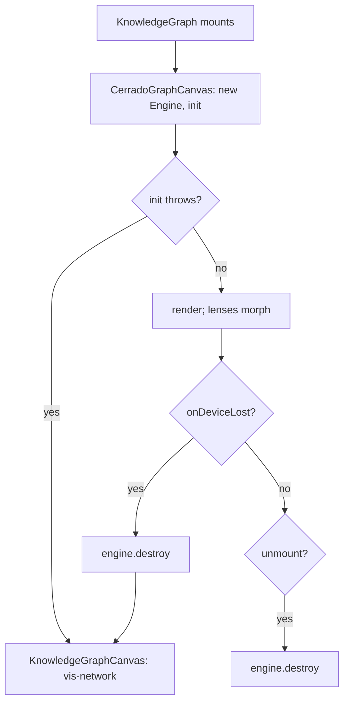

# Plan-020: The knowledge graph moves to cerrado

| Field | Value |
|---|---|
| Status | In Progress |
| Created | 2026-10-08 |
| Author | Danilo Borges |
| Depends on | `@entelekheia-ai/cerrado` with `Engine.destroy()` and `onDeviceLost` (Track 4) |

---

## Read these first

1. This plan's Decision Log — the identifier scheme, the alpha base and the fallback were decided there.
2. `project/tasks/003-cerrado-draws-vis-network-falls-back.md` — how the cerrado canvas mounts, and the
   browser check that proves it.
3. `project/tasks/004-the-engine-is-torn-down-and-falls-back-on-device-loss.md` — teardown, device loss
   and the Playwright lifecycle spec.
4. `project/tasks/002-graph-identifiers-and-the-cerrado-adapter.md` — the `ref:` identifiers per node kind
   and the dot-agent namespace tiers.

## Summary

The knowledge graph — the landing screen of an empty chat and the `/graph` page — is drawn today by
vis-network, with a canopy and a gradient ring painted by hand on its canvas. This plan moves it to
`@entelekheia-ai/cerrado`, a WebGPU engine that draws the graph as a landscape declared in two files: a
`.cmap` that says where each node lives and a `.cview` that says how it looks. vis-network stays, but only
as the fallback for a machine where WebGPU has no adapter or the GPU device is lost; the rest of the app
never learns which of the two is drawing.

## Goals

1. On a machine with a WebGPU adapter, both mounts of the graph — `/[locale]/[workspaceid]/graph` and the
   empty-chat landing — are drawn by cerrado.
2. Without an adapter, or after the GPU device is lost, the same mount shows the vis-network graph with
   the same nodes and the same click behaviour, without a reload.
3. A click on a conversation, knowledge or agent node does what it does today: open the chat, the
   preview modal or the agent overlay.
4. The three lenses — default, chat, agent — exist in cerrado as three `.cview` files over one `.cmap`,
   and switching between them morphs rather than remounts.
5. Navigating between `/chat` and `/graph` any number of times leaves no engine, listener or GPU device of
   an earlier mount alive.

## Scope

### In scope

- Installing `@entelekheia-ai/cerrado` from GitHub Packages, locally and in CI.
- An adapter from the records `useKnowledgeData` already returns to cerrado's `GraphData`.
- The map builder (`graph/map.ts`) and three `.cview` lenses.
- A cerrado canvas component, a fallback selector, and the vis-network canvas kept as the fallback.
- Layout persistence for cerrado in `localStorage`.
- Tests for the adapter and an end-to-end test for mount, unmount and fallback.

### Out of scope

- **Removing vis-network.** It is the fallback, not dead code; a later plan removes it once the fallback
  is never taken.
- **Refreshing the graph after a write.** `useKnowledgeData` reads IndexedDB once on mount today
  (`lib/hooks/use-knowledge-data.ts:12-27`); that stays as it is.
- **Classification ids (`scheme:id`, Wikidata QIDs) on nodes.** cerrado's routing rules match on node
  `type` as well, and the existing `conv-`/`know-`/`agent-` prefixes are enough to route.

## Design

### Who draws

`KnowledgeHomeView` (`components/knowledge/knowledge-home-view.tsx`) renders a new `KnowledgeGraph`
instead of `KnowledgeGraphCanvas`. `KnowledgeGraph` owns the choice: it mounts `CerradoGraphCanvas`
first, and switches to the existing `KnowledgeGraphCanvas` (vis-network,
`components/knowledge/knowledge-graph-canvas.tsx`) when cerrado's `init()` throws — no `navigator.gpu`,
no adapter, or no canvas context — or when `onDeviceLost` fires. Both canvases take the same props: the
records from `useKnowledgeData`, the chats from `ChatbotUIContext`, and the three click handlers. The
choice is made once per mount and is not persisted, so a machine that gains an adapter uses it on the
next mount.

### Data in

`lib/knowledge/cerrado-adapter.ts` turns the records into cerrado's `GraphData` (`nodes`, `edges`).
Every node id is a `ref:` identifier, derived from the record on demand and never stored:

| Entity | Identifier |
|---|---|
| Conversation | `ref:unknown:murici:conversations/<chatId>` |
| Knowledge record | `ref:unknown:murici:knowledge/<record.id>` |
| Agent | by namespace tier: `ref:url:<domain-or-platform path>/<name>`, `ref:email:<address>#<name>`, or `ref:unknown:dot-agent:<name>` for the reserved `unknown` namespace, with `;origin=<repository>` or else `;path=<folder it was opened from>` when known |

Conversations and knowledge records live only in this app's store, which no registered `ref:` type
names, so they take the `unknown` type with the app as species. An agent is named by its publisher, as
the dot-agent agent-id reference's four namespace tiers declare it, mapped the way the identifier
scheme's own conformance vectors map them: a domain or a code-hosting path (a Sourcehut `~user` included)
is a `url`, an email namespace is an `email` with the agent's name as the declared name inside it, and
the reserved `unknown` namespace is the `dot-agent` species of `unknown`. The same agent therefore carries
the same identifier in any application that runs it. The identifier carries no version: the graph draws
one node per agent whatever build produced an artifact (`lib/knowledge/agent-layer.ts` deduplicates by
namespace and name), and an unversioned identifier names the living agent. An agent whose namespace no
tier admits gets no identifier and is left out of both renderers. In the `unknown` namespace one name can be two unrelated agents, so
the identifier adds the one location qualifier the scheme lets separate identity: `origin=` (the
repository the package came from, which no record holds yet) or else `path=` (the folder it was opened
from, read from the `recentAgents` store's `filePath`). Two different values of either make the scheme's
verdict `distinct`; `state=` would say *the same agent in another snapshot* instead, and is not used.
`lib/knowledge/agent-layer.ts` groups agents by that key, so both renderers draw one node per folder. One module, `lib/knowledge/ref.ts`, is the only
place that builds or parses these identifiers: it builds through `@entelekheia/ref-id` and parses the
result back, so a string that does not survive both is a programming error caught in the tests rather than
an identifier that travels malformed. Edges keep plain derived ids (`<from>-><to>`), because nothing outside
the graph names an edge.

Each node also carries a `type` — `conversation`, `knowledge` or `agent` — which is what the lenses'
tiers select, with a record's own `nodeType` in `attrs.nodeType`, and a `murici.group` classification, which
is what the map's routing rules match; routing never parses an identifier. Edges carry `type` `generated_in` (knowledge to conversation), `ran_in` (agent to
conversation) and `produced` (agent to knowledge). The agent layer is reused from `lib/knowledge/agent-layer.ts` (`buildAgentLayer`), so the hidden
`BackgroundSystem` agent stays hidden in both renderers. The adapter is pure and has no GPU or DOM
dependency, which is what lets it be unit-tested.

### Map and lenses

`lib/knowledge/graph/map.ts` builds the map from the graph's own nodes, as eita builds its tag map: one region
per agent, each on a permanent slot of a sunflower spiral from the origin. A conversation no agent ran in, and the knowledge it produced, has no
region and settles loose by its edges (the map declares no `default_region`). A conversation
belongs to the first agent (by id) that ran in it, and its knowledge follows it; routing reads the
`murici.group` classification the adapter writes on every node, so a node with no group is the one left unrouted. The map's `version` is a constant: a new territory takes the next free slot, which is kept in `localStorage`, so adding one never moves another and never discards a saved layout (the version is bumped by hand, as cerrado's `authoring-a-map` and its pitfall 14 require, when the generator or a lens moves nodes: a saved layout hides such a change until it is bumped). On a reload a node with no saved place is scattered and solved while the nodes the layout knows keep theirs. The camera floor sits 2.5 times below the framing of the whole map (the engine ties the two
together), by wrapping the camera's `setZoomRange`. `default.cview`, `chat.cview` and `agent.cview` reproduce the
current lenses (`knowledge-graph-canvas.tsx:670-780`: mass re-weighting, recolouring, which edges show).
All three are written with cerrado's `authoring-a-map` and `authoring-a-view` skills, and validated with
`validateMap`/`validateView` against data from the adapter. A lens switch calls `morphTo`, which needs the
same node count across lenses; the adapter therefore emits every node in every lens, and a lens hides by
tier, never by omission.

### Events out

cerrado reports `onClick` and `onHover` with a node index; `scene.meta[i].id` turns it into the `ref:`
identifier, and the existing click branch (`knowledge-graph-canvas.tsx:783-811`) moves into a shared
`handleGraphClick(id)` that both canvases call, which parses the identifier through `lib/knowledge/ref.ts`
instead of testing a prefix. The vis-network canvas stops building its own `conv-`/`know-`/`agent-` ids
and draws the adapter's output, so the two renderers share one source of identifiers. Hover shows the node kind, as today, and each node draws its kind's icon (chat, file, agent) from the
lucide icon font — in the cerrado renderer only.

### Layout

cerrado solves a layout once per (map, view), freezes it and asks an injected `LayoutStore` to persist
it. That store is the synchronous slice of the Web Storage API (`getItem`, `setItem`, `removeItem`), so
the layout goes to `localStorage`, which Electron keeps in the same per-app partition as IndexedDB. A
reload then renders the same landscape instead of re-solving it.

### Lifecycle

`CerradoGraphCanvas` creates the `Engine` in an effect and calls `engine.destroy()` in that effect's
cleanup. React 18's StrictMode mounts effects twice in development, which exercises exactly this path on
every load. `@entelekheia-ai/cerrado@0.3.0-alpha.0` carries `destroy()` and `onDeviceLost`; a lost device
destroys the engine and hands the mount to the vis-network fallback.

### Installing the package

`@entelekheia-ai/cerrado` is private on GitHub Packages. A committed `.npmrc` maps the `@entelekheia-ai`
scope to `https://npm.pkg.github.com` and reads the token from an environment variable, never from the
file. CI and the Electron release workflow get a token with `read:packages`. The package is bundled by
Next's webpack build (`next build --webpack`) into the renderer, so `scripts/verify-electron-deps.js` and the electron-builder `files`
allowlist are checked rather than assumed to need no change.

## Tracks

- [x] **Track 1 — The package installs.** Task: [tasks/001-the-cerrado-package-installs.md](../tasks/001-the-cerrado-package-installs.md). `.npmrc`, the CI and release-workflow token, and
  `@entelekheia-ai/cerrado@0.2.0` pinned exactly in `package.json`. Acceptance: `npm ci` succeeds locally
  and in CI, `npm run build` and `npm run electron:build` succeed with the package imported from a
  throwaway call site, and `scripts/verify-electron-deps.js` passes.
- [x] **Track 2 — Identifiers, adapter, map and lenses.** Task: [tasks/002-graph-identifiers-and-the-cerrado-adapter.md](../tasks/002-graph-identifiers-and-the-cerrado-adapter.md). `lib/knowledge/ref.ts` and
  `lib/knowledge/cerrado-adapter.ts`, with unit tests over a fixture of records (every node kind, the
  hidden agent, an agent id carrying `:v~digest`), `@entelekheia/ref-id` added as a dependency, the
  vis-network canvas moved onto the adapter's output, and the map builder `graph/map.ts` plus the three `.cview` files.
  Acceptance: the adapter tests pass; every node id the adapter emits parses through `@entelekheia/ref-id`
  with the type `unknown` and the species `murici` or `dot-agent`; and `validateMap` and `validateView`
  report no error against the adapter's output for the fixture.
- [x] **Track 3 — cerrado draws, vis-network falls back.** Task: [tasks/003-cerrado-draws-vis-network-falls-back.md](../tasks/003-cerrado-draws-vis-network-falls-back.md). `KnowledgeGraph`, `CerradoGraphCanvas`,
  `handleGraphClick`, layout persistence, and the fallback on `init()` failure. Acceptance: in a
  browser with WebGPU the graph is drawn by cerrado and each node kind's click does what it does today;
  with WebGPU disabled (`--disable-features=WebGPU`) the vis-network graph appears in the same place.
- [x] **Track 4 — Lifecycle.** Task: [tasks/004-the-engine-is-torn-down-and-falls-back-on-device-loss.md](../tasks/004-the-engine-is-torn-down-and-falls-back-on-device-loss.md). Bump to the cerrado prerelease that ships `destroy()` and `onDeviceLost`,
  call `destroy()` on unmount, and fall back on device loss. Acceptance: a Playwright test navigates
  between `/chat` and `/graph` ten times and then asserts one live engine; a second test forces device
  loss and asserts the vis-network graph is shown.
- [ ] **Track 5 — Verified in the real app.** The maintainer launches the packaged Electron build on each
  desktop OS it ships to and records which renderer each one used. Acceptance: the record names the
  renderer per OS; any OS that fell back is listed in Outcomes with the reason `init()` gave.
- [ ] Run `/vibe-ops:close-plan` — retrospective against the goals, the demotion check. The plan file
      itself is kept. Stays unchecked until the plan is actually closed.

## Success criteria

- `npm test` passes, including the adapter tests.
- The Playwright suite passes, including the navigation and device-loss tests of Track 4.
- `npm run electron:build` produces a build that opens on the graph drawn by cerrado on a machine with a
  WebGPU adapter.
- `grep -rn "vis-network" components/` names only `knowledge-graph-canvas.tsx`, the fallback.

---

## Decision Log

- Decision: cerrado replaces vis-network as the default renderer; vis-network stays only as the fallback
  when WebGPU has no adapter or the device is lost.
  Rationale: Electron's Chromium exposes WebGPU, but an adapter is not guaranteed — blocklisted GPUs,
  virtual machines and parts of Linux return none — and cerrado is WebGPU only by design.
  Date / Author: 2026-10-08 / Danilo Borges
- Decision: the package comes from GitHub Packages at an exact version, not through a `file:` link.
  Rationale: a `file:` link resolves only on a machine with the engine's checkout beside this one, which
  CI and the release build do not have.
  Date / Author: 2026-10-08 / Danilo Borges
- Decision: teardown belongs to the engine (`Engine.destroy()`), not to a singleton kept alive here.
  Rationale: the graph mounts and unmounts on every navigation between the chat and the graph page; a
  workaround here would be maintained by every future consumer of the engine as well.
  Date / Author: 2026-10-08 / Danilo Borges
- Decision: graph node ids are `ref:` identifiers — `ref:unknown:murici:conversations/<id>`,
  `ref:unknown:murici:knowledge/<id>`, `ref:unknown:dot-agent:<namespace>/<name>@<version>` — derived
  on demand and never stored.
  Rationale: another application of the same maintainer already names the same entities this way for its
  own cerrado graph, and an agent id under the `dot-agent` species is then the same node in both; the
  prefixed `conv-`/`know-`/`agent-` ids would be a third, home-made scheme.
  Date / Author: 2026-10-08 / Danilo Borges
- Decision: the plan's branch is cut from `alpha`, not from `main`.
  Rationale: `alpha` carries the toolchain this plan builds on — TypeScript 7, Next 16 and Electron 44 —
  and `main` does not yet; cutting from `main` would build the graph against a toolchain about to be
  replaced. This departs from the repository's rule that a work branch is cut from `main`, by the
  maintainer's decision; the branch carries `alpha`'s `.changeset/pre.json` and is opened back into
  `alpha`.
  Date / Author: 2026-10-08 / Danilo Borges
- Decision: CI reads the private package with `GITHUB_TOKEN` and `permissions: packages: read`; no
  secret is added.
  Rationale: the package grants this repository read access, so the token every workflow already has is
  enough, and it neither expires nor belongs to one person's account.
  Date / Author: 2026-10-08 / Danilo Borges
- Decision: the agent's identifier drops the version — `ref:unknown:dot-agent:<namespace>/<name>`,
  revising the entry above.
  Rationale: the graph deduplicates agents by namespace and name on purpose, one node per agent whatever
  build produced an artifact; a versioned identifier would split that node or name only one of its builds.
  Date / Author: 2026-10-08 / Danilo Borges
- Decision: an agent is identified by its namespace tier — `ref:url:…` for a domain or code-hosting
  path, `ref:email:<address>#<name>`, `ref:unknown:dot-agent:<name>` for the reserved `unknown`
  namespace — revising the two agent entries above.
  Rationale: the identifier scheme retired `dot-agent` as a type and its conformance vectors name a
  dot-agent agent with a host namespace as a `url` and the `unknown` namespace as the `dot-agent` species
  of `unknown`; `ref:unknown:dot-agent:<namespace>/<name>` was a home-made form those vectors do not
  use, and it refused every Sourcehut namespace, which `url` admits.
  Date / Author: 2026-10-08 / Danilo Borges
- Decision: an agent of the `unknown` namespace carries `;origin=` when known, else `;path=` with the
  folder it was opened from; `corpus=` is not used yet.
  Rationale: the dot-agent reference says two `unknown` agents with one name are unrelated, and these are
  the qualifiers whose conflict the identifier scheme declares `distinct`; `state=` declares the same
  identity in another snapshot. `corpus=` is a location hint whose conflict is `undetermined`, so it
  separates nothing; it becomes worth adding when an identifier must resolve back to its package file.
  Date / Author: 2026-10-08 / Danilo Borges
- Decision: delegation split — Track 2's adapter and its tests go to an implementer subagent behind
  `npm test`; the `.cmap` and `.cview` files, Track 3's fallback selection and Track 4's lifecycle stay
  in the main loop; each track's diff is reviewed by a reviewer subagent before it merges; Track 5 is the
  maintainer's, because this environment cannot open an Electron window.
  Rationale: the adapter is mechanical under the id scheme written in Design; the map, the lenses and the
  fallback are judgements about how the graph should look and behave.
  Date / Author: 2026-10-08 / Danilo Borges
- Decision: the map is generated from the content, one region per agent, instead of the hand-written three
  regions (Agents, Conversations, Knowledge) of `murici.cmap`, which is deleted.
  Rationale: the vis-network graph grouped by content — a canopy per hub — and three fixed regions lost that.
  cerrado 0.3.0-alpha.0 declares a node `cluster` field that no engine code reads, so the grouping goes
  through a routing rule over a `murici.group` classification, with the map built in code as eita's is.
  Lenses stay `.cview` files over one map, so `morphTo` keeps working. Per agent rather than per
  conversation was the maintainer's choice, and so was leaving conversations without an agent loose rather
  than giving them a territory.
  Date / Author: 2026-10-08 / Danilo Borges
- Decision: every lens doubles its `size_multiplier` (nodes and icons) and halves `paint.drop_scale` to 6.5; the
  chat and agent canopies keep the region's colour; the chat lens shows the territory names only from zoom
  0.3 on; the adapter writes a `weight` on conversations and agents.
  Rationale: a node's radius is `(8 + 2·√weight) × size_multiplier` and the canopy radius is that radius times
  `drop_scale` (13 by default), so doubling the nodes alone doubled the wash and merged neighbouring
  territories; halving `drop_scale` keeps the wash where it was. A lens styles by tier, so one canopy colour
  per tier would have painted every conversation alike where vis-network gave each its own; the region's
  colour, one per agent, carries the identity instead. The weight makes a busy conversation or agent read as
  the hub vis-network drew it. The chat lens hides the names at the macro zoom because the whole map is
  already named by its territories' colours there.
  The default lens then grew its high tier by 50% and its other two by 100% more (4.8, 4.0, 3.6, with
  `drop_scale` 4.5) and dropped its fixed node colours, and the chat lens dropped the fixed fills of
  conversations and agents: a connection line takes the colours of its two ends, so the region's colour on
  both ends is what makes the chat–agent line the region's colour. The loose parent's ring colour
  (`loose_color`) is transparent in the default and chat lenses, so a conversation's ring is its region's
  rather than the agent's amber; the line is wide and opaque, and the region's node colour is darker than its
  wash so the line reads against it. The default lens stages its labels as eita's default view does, in the
  course form: icons and territory names from afar, the nodes' own names from zoom 0.6 and the territory names leave at the same seam, over a ramp
  0.075 wide (the framing of the whole map sits near 0.36 on that scale); the values were read by the
  maintainer off a zoom readout while zooming.
  Date / Author: 2026-10-08 / Danilo Borges
- Decision: a territory's place and hue come from a permanent slot, not from its position in the sorted list,
  and the map's `version` is a constant.
  Rationale: placing by list position moved every region whenever an agent was added, and a `version`
  derived from the set of territories threw the saved layout away at the same moment, so the whole graph was
  re-solved. A slot is kept in `localStorage` (`murici.graph.slots`) and a new territory takes the lowest
  free one, so only the new region appears; slots of agents that left stay reserved. The cerrado
  alpha re-solves every node when the saved layout lacks some of them (its local re-solve is a separate,
  unbuilt step), but the known nodes start at their saved places inside unmoved anchors, and only the
  nodes with no saved place are scattered.
  Date / Author: 2026-10-09 / Danilo Borges
- Decision: the canvas sets `Engine.nodeZoomGrowth` to 0.35.
  Rationale: the engine's default of 0.15 grows a node's on-screen size by only about 1.5 times across the
  whole zoom range, so zooming in did not make the icons larger; at 0.5 they grew by about 3.5 times and the captions, which
  follow by the same factor (the engine ties the two), grew too large, so 0.35 (about 2.4 times) is the
  value kept. It is a host setting, not a map or
  view key, so it lives in `cerrado-graph-canvas.tsx`.
  Date / Author: 2026-10-09 / Danilo Borges
- Decision: the chat lens uses the overview lens's zoom scale: from afar only the chats and the agents, each
  named, with the files and the territory names off; at 0.6 the files and the territory names come in, over
  the same 0.075 ramp.
  Rationale: the same thresholds mean the same distance in every lens, and the chat lens is about the
  conversations, which are the layer worth naming first. Replaces the earlier stop at 0.3 that only hid the
  territory names.
  Date / Author: 2026-10-09 / Danilo Borges
- Decision: the watercolour follows the page theme. The lenses keep only `drop_scale` in `paint:`; the rest
  is `graph/paint.ts`: one shared form taken from the five signatures of the technique study
  (`project/research/cerrado/2026-07-31-tecnicas-de-aquarela-npr.md`: a pigment rim, a world-space wobble of
  the contour, two glazes, sub-coats crumbling at the edge, a faint broad grain), laid at alpha 0.85 with an
  underwash on a light page and at alpha 0.85 with a soft edge and a light mask on a dark one, merged into
  each view before the scene is built; the map's node colour is deep on a light page and bright on a dark
  one. A change of theme does not remount the engine: it waits for the page's colour transition to end, re-reads the
  paper, rebuilds the map and the lenses for it and eases to the new colours with `buildScene` and `morphTo`,
  as a lens switch does, so the graph does not blink. The canvas background follows the page's own CSS
  transition frame by frame; the captions take their new ink and, for the plates behind them, the page's final
  colour (read off the running transition) at the start.
  Rationale: the paint was the dark-canvas recipe tuned by eye against a light page, and a lens carries one
  paint block. A theme's colours are not a property of a lens, so they live in code beside the map rather than
  in duplicated `.cview` files; duplicating the lenses per theme is the fallback if a colour that the lenses
  themselves declare (the grey of the files, the edge colour) stops reading on one theme.
  Date / Author: 2026-10-09 / Danilo Borges
- Decision: the agent lens mirrors the chat lens with the roles swapped: agents are the large anchors
  (`size_multiplier` 6.8, repulsion 2.6, mass 3), conversations take the wide, loosely held tier (size 3,
  edge length 2.2, mass 1), the zoom course is the same (agents and chats named from afar, files as dots,
  names and territory names at 0.6), the fixed fills and the amber loose colour are gone, and the strong line
  is the one the vis-network lens drew lightly (knowledge to conversation), since agent to conversation stays
  hidden there.
  Rationale: the same lens behaviour in both, with the line that is visible in each carrying the weight.
  The loose conversations of this lens fall to the engine's fixed grey of the lowest tier, which is dark
  and reads poorly on a dark page; the colour of unrouted nodes is left to a change in cerrado.
  Date / Author: 2026-10-09 / Danilo Borges

## Outcomes & Retrospective

- Track 5, macOS (Apple silicon), 2026-10-08: the packaged app (`electron-builder --dir`, unsigned) drew
  the graph with cerrado on the app's real data — a WebGPU adapter present, no vis-network canvas, icons
  loaded. Launched from the agent's shell with `--remote-debugging-port` and inspected over CDP. It showed
  conversations with no chat row captioned by their full identifier; they now read "Conversation", as in
  the vis-network canvas. Windows and Linux are not yet run.

---

## Open questions

- Whether Electron 44's Chromium, with `sandbox: true`, exposes a WebGPU adapter on Linux for the
  machines this app ships to. Track 5 measures it.
