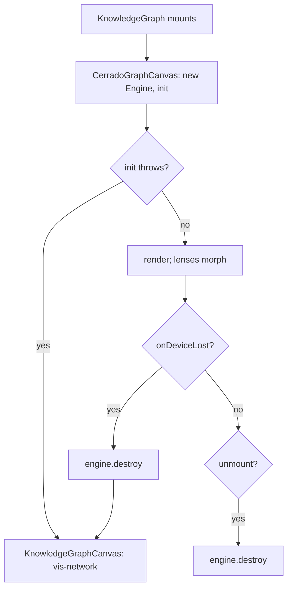

# Plan-020: The knowledge graph moves to cerrado

| Field | Value |
|---|---|
| Status | Backlog |
| Created | 2026-10-08 |
| Author | Danilo Borges |
| Depends on | `@entelekheia-ai/cerrado` with `Engine.destroy()` and `onDeviceLost` (Track 4) |

---

## Summary

The knowledge graph — the landing screen of an empty chat and the `/graph` page — is drawn today by
vis-network, with a canopy and a gradient ring painted by hand on its canvas. This plan moves it to
`@entelekheia-ai/cerrado`, a WebGPU engine that draws the graph as a landscape declared in two files: a
`.cmap` that says where each node lives and a `.cview` that says how it looks. vis-network stays, but only
as the fallback for a machine where WebGPU has no adapter or the GPU device is lost; the rest of the app
never learns which of the two is drawing.

## Goals

1. On a machine with a WebGPU adapter, both mounts of the graph — `/[locale]/[workspaceid]/graph` and the
   empty-chat landing — are drawn by cerrado.
2. Without an adapter, or after the GPU device is lost, the same mount shows the vis-network graph with
   the same nodes and the same click behaviour, without a reload.
3. A click on a conversation, knowledge or agent node does what it does today: open the chat, the
   preview modal or the agent overlay.
4. The three lenses — default, chat, agent — exist in cerrado as three `.cview` files over one `.cmap`,
   and switching between them morphs rather than remounts.
5. Navigating between `/chat` and `/graph` any number of times leaves no engine, listener or GPU device of
   an earlier mount alive.

## Scope

### In scope

- Installing `@entelekheia-ai/cerrado` from GitHub Packages, locally and in CI.
- An adapter from the records `useKnowledgeData` already returns to cerrado's `GraphData`.
- `murici.cmap` and three `.cview` lenses.
- A cerrado canvas component, a fallback selector, and the vis-network canvas kept as the fallback.
- Layout persistence for cerrado in IndexedDB.
- Tests for the adapter and an end-to-end test for mount, unmount and fallback.

### Out of scope

- **Removing vis-network.** It is the fallback, not dead code; a later plan removes it once the fallback
  is never taken.
- **Refreshing the graph after a write.** `useKnowledgeData` reads IndexedDB once on mount today
  (`lib/hooks/use-knowledge-data.ts:12-27`); that stays as it is.
- **Classification ids (`scheme:id`, Wikidata QIDs) on nodes.** cerrado's routing rules match on node
  `type` as well, and the existing `conv-`/`know-`/`agent-` prefixes are enough to route.

## Design

### Who draws

`KnowledgeHomeView` (`components/knowledge/knowledge-home-view.tsx`) renders a new `KnowledgeGraph`
instead of `KnowledgeGraphCanvas`. `KnowledgeGraph` owns the choice: it mounts `CerradoGraphCanvas`
first, and switches to the existing `KnowledgeGraphCanvas` (vis-network,
`components/knowledge/knowledge-graph-canvas.tsx`) when cerrado's `init()` throws — no `navigator.gpu`,
no adapter, or no canvas context — or when `onDeviceLost` fires. Both canvases take the same props: the
records from `useKnowledgeData`, the chats from `ChatbotUIContext`, and the three click handlers. The
choice is made once per mount and is not persisted, so a machine that gains an adapter uses it on the
next mount.

### Data in

`lib/knowledge/cerrado-adapter.ts` turns the records into cerrado's `GraphData` (`nodes`, `edges`).
Every node id is a `ref:` identifier, derived from the record on demand and never stored:

| Entity | Identifier |
|---|---|
| Conversation | `ref:unknown:murici:conversations/<chatId>` |
| Knowledge record | `ref:unknown:murici:knowledge/<record.id>` |
| Agent | `ref:unknown:dot-agent:<namespace>/<name>` |

The `unknown` type with a declared species is the form for an entity no registered `ref:` type names; the
species is the application for what only this app holds, and `dot-agent` for an agent, so the same agent
carries the same identifier in any application that runs it. The agent's identifier carries no version:
the graph draws one node per agent whatever build produced an artifact (`lib/knowledge/agent-layer.ts`
deduplicates by namespace and name), and an unversioned identifier names the living agent. An agent in a
namespace the locator grammar refuses (`~user/…`) gets no identifier and is left out of both renderers. One module, `lib/knowledge/ref.ts`, is the only
place that builds or parses these identifiers: it builds through `@entelekheia/ref-id` and parses the
result back, so a string that does not survive both is a programming error caught in the tests rather than
an identifier that travels malformed. Edges keep plain derived ids (`<from>-><to>`), because nothing outside
the graph names an edge.

Each node also carries a `type` — `conversation`, `knowledge` or `agent` — which is what `murici.cmap`'s
routing rules match, with a record's own `nodeType` in `attrs.nodeType`; routing never parses an
identifier. Edges carry `type` `generated_in` (knowledge to conversation), `ran_in` (agent to
conversation) and `produced` (agent to knowledge). The agent layer is reused from `lib/knowledge/agent-layer.ts` (`buildAgentLayer`), so the hidden
`BackgroundSystem` agent stays hidden in both renderers. The adapter is pure and has no GPU or DOM
dependency, which is what lets it be unit-tested.

### Map and lenses

`lib/knowledge/graph/murici.cmap` declares three regions (Agents, Conversations, Knowledge) and routes by
`type`; every node is routed, so it declares no `default_region`. `default.cview`, `chat.cview` and `agent.cview` reproduce the
current lenses (`knowledge-graph-canvas.tsx:670-780`: mass re-weighting, recolouring, which edges show).
All three are written with cerrado's `authoring-a-map` and `authoring-a-view` skills, and validated with
`validateMap`/`validateView` against data from the adapter. A lens switch calls `morphTo`, which needs the
same node count across lenses; the adapter therefore emits every node in every lens, and a lens hides by
tier, never by omission.

### Events out

cerrado reports `onClick` and `onHover` with a node index; `scene.meta[i].id` turns it into the `ref:`
identifier, and the existing click branch (`knowledge-graph-canvas.tsx:783-811`) moves into a shared
`handleGraphClick(id)` that both canvases call, which parses the identifier through `lib/knowledge/ref.ts`
instead of testing a prefix. The vis-network canvas stops building its own `conv-`/`know-`/`agent-` ids
and draws the adapter's output, so the two renderers share one source of identifiers. Hover shows the node kind, as today.

### Layout

cerrado solves a layout once per (map, view), freezes it and asks an injected `LayoutStore` to persist
it. The store is backed by a new IndexedDB object store, `graphLayouts`, keyed by map and view, added
through the existing schema migration in `lib/local-db/schema.ts`. A reload then renders the same
landscape instead of re-solving it. A new store is one of the changes the repository's `AGENTS.md` asks to be recorded, so Track 3
updates it.

### Lifecycle

`CerradoGraphCanvas` creates the `Engine` in an effect and calls `engine.destroy()` in that effect's
cleanup. React 18's StrictMode mounts effects twice in development, which exercises exactly this path on
every load. Until a cerrado release carries `destroy()`, Track 3 runs on `0.2.0` without it; Track 4 makes
the cleanup real.

### Installing the package

`@entelekheia-ai/cerrado` is private on GitHub Packages. A committed `.npmrc` maps the `@entelekheia-ai`
scope to `https://npm.pkg.github.com` and reads the token from an environment variable, never from the
file. CI and the Electron release workflow get a token with `read:packages`. The package is bundled by
Next's webpack build (`next build --webpack`) into the renderer, so `scripts/verify-electron-deps.js` and the electron-builder `files`
allowlist are checked rather than assumed to need no change.

## Tracks

- [x] **Track 1 — The package installs.** Task: [tasks/001-the-cerrado-package-installs.md](../tasks/001-the-cerrado-package-installs.md). `.npmrc`, the CI and release-workflow token, and
  `@entelekheia-ai/cerrado@0.2.0` pinned exactly in `package.json`. Acceptance: `npm ci` succeeds locally
  and in CI, `npm run build` and `npm run electron:build` succeed with the package imported from a
  throwaway call site, and `scripts/verify-electron-deps.js` passes.
- [x] **Track 2 — Identifiers, adapter, map and lenses.** Task: [tasks/002-graph-identifiers-and-the-cerrado-adapter.md](../tasks/002-graph-identifiers-and-the-cerrado-adapter.md). `lib/knowledge/ref.ts` and
  `lib/knowledge/cerrado-adapter.ts`, with unit tests over a fixture of records (every node kind, the
  hidden agent, an agent id carrying `:v~digest`), `@entelekheia/ref-id` added as a dependency, the
  vis-network canvas moved onto the adapter's output, and `murici.cmap` plus the three `.cview` files.
  Acceptance: the adapter tests pass; every node id the adapter emits parses through `@entelekheia/ref-id`
  with the type `unknown` and the species `murici` or `dot-agent`; and `validateMap` and `validateView`
  report no error against the adapter's output for the fixture.
- [ ] **Track 3 — cerrado draws, vis-network falls back.** `KnowledgeGraph`, `CerradoGraphCanvas`,
  `handleGraphClick`, the `graphLayouts` store, and the fallback on `init()` failure. Acceptance: in a
  browser with WebGPU the graph is drawn by cerrado and each node kind's click does what it does today;
  with WebGPU disabled (`--disable-features=WebGPU`) the vis-network graph appears in the same place.
- [ ] **Track 4 — Lifecycle.** Bump to the cerrado prerelease that ships `destroy()` and `onDeviceLost`,
  call `destroy()` on unmount, and fall back on device loss. Acceptance: a Playwright test navigates
  between `/chat` and `/graph` ten times and then asserts one live engine; a second test forces device
  loss and asserts the vis-network graph is shown.
- [ ] **Track 5 — Verified in the real app.** The maintainer launches the packaged Electron build on each
  desktop OS it ships to and records which renderer each one used. Acceptance: the record names the
  renderer per OS; any OS that fell back is listed in Outcomes with the reason `init()` gave.
- [ ] Run `/vibe-ops:close-plan` — retrospective against the goals, the demotion check. The plan file
      itself is kept. Stays unchecked until the plan is actually closed.

## Success criteria

- `npm test` passes, including the adapter tests.
- The Playwright suite passes, including the navigation and device-loss tests of Track 4.
- `npm run electron:build` produces a build that opens on the graph drawn by cerrado on a machine with a
  WebGPU adapter.
- `grep -rn "vis-network" components/` names only `knowledge-graph-canvas.tsx`, the fallback.

---

## Decision Log

- Decision: cerrado replaces vis-network as the default renderer; vis-network stays only as the fallback
  when WebGPU has no adapter or the device is lost.
  Rationale: Electron's Chromium exposes WebGPU, but an adapter is not guaranteed — blocklisted GPUs,
  virtual machines and parts of Linux return none — and cerrado is WebGPU only by design.
  Date / Author: 2026-10-08 / Danilo Borges
- Decision: the package comes from GitHub Packages at an exact version, not through a `file:` link.
  Rationale: a `file:` link resolves only on a machine with the engine's checkout beside this one, which
  CI and the release build do not have.
  Date / Author: 2026-10-08 / Danilo Borges
- Decision: teardown belongs to the engine (`Engine.destroy()`), not to a singleton kept alive here.
  Rationale: the graph mounts and unmounts on every navigation between the chat and the graph page; a
  workaround here would be maintained by every future consumer of the engine as well.
  Date / Author: 2026-10-08 / Danilo Borges
- Decision: graph node ids are `ref:` identifiers — `ref:unknown:murici:conversations/<id>`,
  `ref:unknown:murici:knowledge/<id>`, `ref:unknown:dot-agent:<namespace>/<name>@<version>` — derived
  on demand and never stored.
  Rationale: another application of the same maintainer already names the same entities this way for its
  own cerrado graph, and an agent id under the `dot-agent` species is then the same node in both; the
  prefixed `conv-`/`know-`/`agent-` ids would be a third, home-made scheme.
  Date / Author: 2026-10-08 / Danilo Borges
- Decision: the plan's branch is cut from `alpha`, not from `main`.
  Rationale: `alpha` carries the toolchain this plan builds on — TypeScript 7, Next 16 and Electron 44 —
  and `main` does not yet; cutting from `main` would build the graph against a toolchain about to be
  replaced. This departs from the repository's rule that a work branch is cut from `main`, by the
  maintainer's decision; the branch carries `alpha`'s `.changeset/pre.json` and is opened back into
  `alpha`.
  Date / Author: 2026-10-08 / Danilo Borges
- Decision: CI reads the private package with `GITHUB_TOKEN` and `permissions: packages: read`; no
  secret is added.
  Rationale: the package grants this repository read access, so the token every workflow already has is
  enough, and it neither expires nor belongs to one person's account.
  Date / Author: 2026-10-08 / Danilo Borges
- Decision: the agent's identifier drops the version — `ref:unknown:dot-agent:<namespace>/<name>`,
  revising the entry above.
  Rationale: the graph deduplicates agents by namespace and name on purpose, one node per agent whatever
  build produced an artifact; a versioned identifier would split that node or name only one of its builds.
  Date / Author: 2026-10-08 / Danilo Borges
- Decision: delegation split — Track 2's adapter and its tests go to an implementer subagent behind
  `npm test`; the `.cmap` and `.cview` files, Track 3's fallback selection and Track 4's lifecycle stay
  in the main loop; each track's diff is reviewed by a reviewer subagent before it merges; Track 5 is the
  maintainer's, because this environment cannot open an Electron window.
  Rationale: the adapter is mechanical under the id scheme written in Design; the map, the lenses and the
  fallback are judgements about how the graph should look and behave.
  Date / Author: 2026-10-08 / Danilo Borges

## Outcomes & Retrospective

*Not started.*

---

## Open questions

- **Track 2 — an agent in a Sourcehut namespace (`~user/…`) has no identifier.** The `unknown` locator
  admits only `[A-Za-z0-9._-]` segments, so such an agent is left out of both renderers for now.
  Options: (a) keep it out; (b) give `~` namespaces another identifier form here; (c) ask the identifier
  scheme to admit `~` in the `unknown` locator and wait for its release. Recommended: (c), with (a) until
  it lands.
- Whether Electron 44's Chromium, with `sandbox: true`, exposes a WebGPU adapter on Linux for the
  machines this app ships to. Track 5 measures it.
