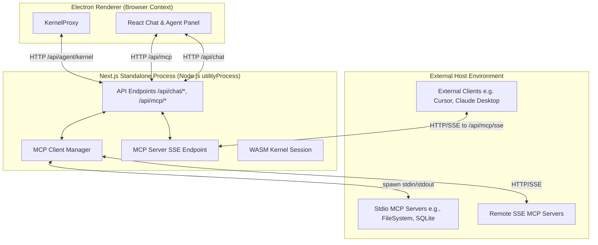
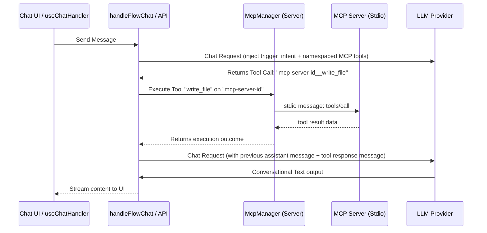

<!--
 Copyright (c) 2026 Danilo Borges (https://github.com/daniloborges)

 Licensed under the Apache License, Version 2.0 (the "License");
 you may not use this file except in compliance with the License.
 You may obtain a copy of the License at

 https://www.apache.org/licenses/LICENSE-2.0
-->

# RFC-0006: Model Context Protocol (MCP) Integration Specification

| Field | Value |
|---|---|
| Status | Proposed |
| Created | 2026-06-21 |
| Author | Danilo Borges |
| Depends on | [dot-agent.md](../dot-agent.md), [AGENTS.md](../AGENTS.md) |
| Related | None |

---

## Summary

This RFC defines the architecture for integrating the **Model Context Protocol (MCP)** into Murici. The integration is dual-faceted:
1. **MCP Client**: Enables Murici to connect to external MCP servers (via Stdio child processes or SSE) to discover and execute tools, resources, and prompts inside LLM conversation turns and FSM behavior execution loops.
2. **MCP Server**: Exposes Murici's internal features (FSM states, conversation database, agent behaviors, and intent routing) to external MCP clients (such as Claude Desktop or Cursor) via a local HTTP SSE endpoint.

---

## Motivation

Murici uses a WASM FSM engine (`dot-agent-kernel`) to define deterministic chat behaviors. Currently, interaction with external tools is restricted. To make Murici a highly extensible AI desktop platform:
- We need a standardized protocol to connect LLMs to local filesystems, databases, API integration layers, and custom code environments without hardcoding them into the Next.js/React codebase.
- The WASM kernel emits execution effects such as `run_tool` and `run_script`. The MCP protocol is the ideal mechanism to implement these effects dynamically using pluggable servers.
- Exposing Murici's own state and active behaviors as an MCP Server allows users to connect their existing CLI and desktop AI tools (like Claude Desktop) directly to Murici's state machine, turning Murici into a coordinate controller for other tools.

---

## Scope

### In Scope
- **MCP Config Panel**: A UI workspace/profile setting to register, enable, and disable MCP servers (Stdio with command/args/env, or SSE with URL).
- **Server-Side MCP Manager**: A process manager running inside the Next.js server (Node.js utilityProcess) that handles the lifecycle of Stdio child processes and connection states for SSE servers.
- **LLM Tool Injection**: Merging MCP-defined tools dynamically into the chat completion payloads of all supported providers (OpenAI, Anthropic, Custom, Local).
- **Execution Interception Loop**: Intercepting LLM tool execution requests in `handleFlowChat` and `use-chat-handler.tsx`, forwarding requests to the local MCP client manager, and returning the outputs.
- **FSM Effect Execution**: Executing WASM kernel effects (`run_tool`, `run_script`) by mapping their `target` to corresponding MCP server tools.
- **Murici SSE Server Endpoint**: Exposing a standard `/api/mcp/sse` endpoint inside the Next.js server to advertise Murici's local tools and active conversation states.
- **Sandboxing Executables (Phase 1)**: Restricting environment variables, checking argument folders against active workspace directories, and running subprocesses inside platform-specific sandbox containers (e.g. `sandbox-exec` on macOS).

### Out of Scope
- **Hosted Cloud MCP Broker**: All MCP connections are resolved locally within the user's host environment.

---

## Architecture Topology

The diagram below illustrates the communication boundaries. Since the Electron renderer is isolated (`contextIsolation: true`), all Node.js operations (like spawning stdio processes) are handled by the Next.js standalone server process.



---

## Decisions

### 1. Storage & Schema: Configuration Persistence
MCP server configurations will be stored in IndexedDB under the `"entelekheia"` database. We will introduce an `mcp_servers` store with the following structure:

```ts
export interface McpServerConfig {
  id: string; // UUID
  name: string;
  type: "stdio" | "sse";
  enabled: boolean;
  
  // Stdio configuration
  command?: string; // e.g. "npx" or "python"
  args?: string[];  // e.g. ["-y", "@modelcontextprotocol/server-filesystem", "/path"]
  env?: Record<string, string>;

  // SSE configuration
  url?: string;     // e.g. "http://localhost:8000/sse"
}
```

### 2. Next.js Client Process Manager (`lib/mcp-manager.ts`)
The server-side component of Murici will handle connections to the configured servers. It will maintain a cache of active MCP clients:

```ts
import { Client } from "@modelcontextprotocol/sdk/client/index.js";
import { StdioClientTransport } from "@modelcontextprotocol/sdk/client/stdio.js";
import { SseClientTransport } from "@modelcontextprotocol/sdk/client/sse.js";

class McpManager {
  private activeClients: Map<string, { client: Client; transport: any }> = new Map();

  async initializeServer(config: McpServerConfig) {
    if (this.activeClients.has(config.id)) return;
    
    let transport;
    if (config.type === "stdio") {
      transport = new StdioClientTransport({
        command: config.command!,
        args: config.args ?? [],
        env: { ...process.env, ...config.env }
      });
    } else {
      transport = new SseClientTransport(new URL(config.url!));
    }

    const client = new Client({
      name: "murici-client",
      version: "1.0.0"
    }, {
      capabilities: {
        tools: {},
        resources: {}
      }
    });

    await client.connect(transport);
    this.activeClients.set(config.id, { client, transport });
  }

  async listCombinedTools() {
    let combinedTools: any[] = [];
    for (const [id, entry] of this.activeClients.entries()) {
      try {
        const response = await entry.client.listTools();
        // Map MCP tools to OpenAI/Anthropic function call format
        const formatted = response.tools.map(tool => ({
          type: "function",
          function: {
            name: `${id}__${tool.name}`, // Namespaced to avoid collisions
            description: tool.description,
            parameters: tool.inputSchema
          }
        }));
        combinedTools.push(...formatted);
      } catch (err) {
        console.error(`Failed to list tools for MCP server ${id}:`, err);
      }
    }
    return combinedTools;
  }

  async callTool(namespacedName: string, args: any) {
    const [serverId, ...toolNameParts] = namespacedName.split("__");
    const toolName = toolNameParts.join("__");
    const entry = this.activeClients.get(serverId);
    if (!entry) throw new Error(`MCP server ${serverId} is not connected.`);

    return await entry.client.callTool({
      name: toolName,
      arguments: args
    });
  }

  async shutdown() {
    for (const [id, entry] of this.activeClients.entries()) {
      try {
        await entry.transport.close();
      } catch {}
    }
    this.activeClients.clear();
  }
}
```

> [!IMPORTANT]
> To prevent orphan subprocesses, the `stopNextServer` function in `electron/next-server.ts` or Node's `process.on('exit')` will register a cleanup hook calling `McpManager.shutdown()`.

### 3. Tool Execution & Interception Flow
The tool execution pipeline in `components/chat/chat-helpers/index.ts` (specifically inside `handleFlowChat` and standard stream routes) will be modified to support sequential/multi-turn tool calling.

When the LLM yields a tool call:
1. **Check namespace**: If the tool name contains `__` (indicating an MCP tool), capture it.
2. **Execute tool**: Route it via API `/api/mcp/call` to the `McpManager`.
3. **Feed Result**: Append the tool response structure to the conversation messages and request the next LLM turn.
4. **FSM compatibility**: Ensure that if the FSM requires a transition, `trigger_intent` is executed in tandem or evaluated in the sequence.



### 4. FSM Effect Interception (`run_tool` & `run_script`)
When the WASM engine transitions state and returns:
- A `run_tool` effect (e.g., `target: "fs/read_file"`, `label: "Read log"`), the client proxy or chat handler will intercept the effect, match it with the active MCP tools (e.g., namespace map), execute it via the MCP manager, and supply the outcome back to the state machine by triggering the associated FSM event (typically `tool.done`).

### 5. Murici as an MCP Server (SSE Endpoint)
To allow external agents to interface with Murici, the Next.js server will expose the endpoint `/api/mcp/sse`.

- **Transport**: Server-Sent Events (SSE) for outgoing protocol messages, combined with standard HTTP POST requests for incoming protocol messages.
- **Exposed Tools**:
  - `list_conversations`: Returns a list of conversations in IndexedDB.
  - `get_conversation`: Returns the messages of a selected conversation.
  - `load_behavior`: Programmatically loads a `.agent` or `.flow` SCXML behavior package.
  - `trigger_intent`: Programmatically fires a transition event to the active WASM FSM instance.

To avoid port binding issues (since Electron assigns a random port), Murici will write its active port and token to a local runtime state file (e.g., `~/.entelekheia/murici-mcp.json`) upon startup. External tools can read this file to discover Murici's MCP Server URL.

### 6. Sandboxing Executables (Phase 1)
To mitigate the security risks of executing arbitrary binaries from third-party MCP servers, Murici implements a Phase 1 sandboxing architecture:

- **Argument Inspection**: The `McpManager` parses command-line arguments for path targets (e.g. for the FileSystem server). It rejects any path arguments that resolve outside the active workspace directory, unless explicitly authorized by the user.
- **Environment Scrubbing**: Subprocesses are spawned with a sanitized copy of environment variables. Sensitive user credentials, keychain access keys, and system configs are removed by default before spawning stdio servers.
- **Platform-Specific Sandboxing Wrapper**:
  - **macOS**: Murici wraps stdio server execution commands inside `sandbox-exec` using a restrictive temporary profile (restricting network access and file writing outside the workspace path).
  - **Linux**: Spawns processes using `bubblewrap` or restricted user profiles if installed on the host system.
  - **Windows**: Spawns processes in low-integrity levels or restricts access tokens.
- **User Approval Gating**: Tools configured with high-risk attributes (e.g., executing commands or making network calls) trigger a UI permission request toast/modal before the Next.js server executes the call.

---

## Files Changed

| File | Change |
|---|---|
| `types/mcp.ts` | Define type schemas for `McpServerConfig` and communication states. |
| `db/mcp.ts` | IndexedDB helpers to manage registered MCP servers. |
| `lib/mcp-manager.ts` | Core manager for connecting to Stdio/SSE MCP servers, mapping/resolving tools. |
| `app/api/mcp/route.ts` | API endpoints to add/remove/refresh MCP connections and call tools. |
| `app/api/mcp/sse/route.ts` | Host SSE endpoints enabling Murici to act as an MCP server. |
| `components/chat/chat-helpers/index.ts` | Update `handleFlowChat` to parse, execute, and feed back custom MCP tool loops. |
| `components/chat/chat-hooks/use-chat-handler.tsx` | Integrate FSM `run_tool` and `run_script` effect resolution against the MCP client. |
| `components/utility/global-state.tsx` | App-wide state containing active MCP tools, status indicators, and configs. |
| `components/settings/mcp-settings-panel.tsx` | UI panel for registering, editing, and checking status of MCP servers. |
| `electron/next-server.ts` | Add cleanup handler to terminate MCP sub-processes cleanly on exit. |

---

## Open Questions

- **Execution Context / Workspaces**: Should MCP tool servers be globally active, or scoped to specific workspaces? (For example, should a FileSystem MCP server only have access to the workspace's root directory?)
- **Confirmation dialogs**: Should we show a popup to the user before running high-risk tools (e.g., writing files, running commands, executing network calls)? We plan to implement a permission flag (`requiresApproval`) per tool or globally.
- **Node paths on macOS/Windows**: When Electron runs in packaged mode, the environment path (`PATH`) might differ from the user's interactive shell. How do we ensure commands like `npx` or `python` are found? We may need to allow users to configure the path to the executable manually.
