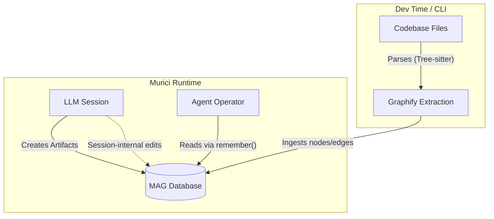

<!--
 Copyright (c) 2026 Danilo Borges (https://github.com/daniloborges)

 Licensed under the Apache License, Version 2.0 (the "License");
 you may not use this file except in compliance with the License.
 You may obtain a copy of the License at

 https://www.apache.org/licenses/LICENSE-2.0
-->

# RFC-0007: MAG Referential Integrity and Graphify Ingestion

| Field | Value |
|---|---|
| Status | Proposed |
| Created | 2026-06-23 |
| Author | Danilo Borges |
| Depends on | [0002-knowledge-graph-data-model.md](./0002-knowledge-graph-data-model.md) |
| Related | None |

---

## Summary

This RFC defines the architectural integration of static code graphs (Graphify) into the Multi-layered Artifact Graph (MAG) and establishes the rules for referential integrity within MAG. Instead of querying external JSON files generated by Graphify at runtime, Murici will use Graphify as an ingestion pipeline to populate the MAG database directly. Furthermore, this document mandates strict referential integrity for artifact lineages (e.g., `derived_from` edges), forbidding "dangling pointers" while defining the scope of graph mutations: Murici only tracks changes generated *within* LLM sessions, leaving real-time filesystem synchronization to future proprietary runtimes.

---

## Motivation

As MAG grows to encompass both cognitive artifacts (conversations, summaries) and static codebase knowledge, we face a storage and query routing dilemma:
1. Loading large `graph.json` files from Graphify into memory at runtime for the `remember()` tool is highly inefficient.
2. If MAG artifacts reference code symbols using normalized IDs (e.g., `derived_from: "pkg::murici::utils::XPTO"`), external refactoring (like renaming a function in VSCode) breaks these links, creating dangling pointers that corrupt the context window.
3. Attempting to build a background daemon in Murici to watch the filesystem and reconcile the graph in real-time adds immense complexity to the open-source runtime.

To solve this, we must unify the storage into the existing MAG database, enforce strict rules against broken links, and clearly bound the scope of Murici's responsibilities.

---

## Scope

### In Scope
- **Unified DB Ingestion:** Transforming Graphify's static output into nodes and edges within the MAG persistence layer (e.g., IndexedDB).
- **Referential Integrity Enforcement:** Rules for mutating or archiving `derived_from` edges when the underlying code symbol changes.
- **Session-Bounded Mutations:** Restricting automatic graph reconciliation to events and edits that occur *inside* a Murici LLM session.

### Out of Scope
- **Real-time Filesystem Syncing:** Watching external files (e.g., via `chokidar`) and updating the MAG DB in the background when the user edits code in an external IDE. (This is reserved for future advanced runtimes).
- **Graphify CLI Modifications:** Changes to the Graphify Rust/Python core itself, apart from perhaps configuring it to output directly to Murici's DB schema format.

---

## Architecture Topology

---

## Decisions

### 1. Unified Storage: Graphify as an Ingestion Pipeline
Graphify will no longer act as a standalone query provider at runtime. Instead, Graphify will serve as an ingestion pipeline that populates the same database (e.g., IndexedDB or SQLite) used by MAG. 
- **Node Types:** Code elements (functions, classes) will be stored as specific node types (e.g., `code_symbol`) within MAG.
- **Benefit:** `remember()` queries can traverse both semantic artifacts and code dependencies in a single database lookup, optimizing memory and speed.

### 2. Strict Referential Integrity
A dangling pointer (a link to a non-existent ID) is considered "garbage" in the active system state.
- If an artifact is `derived_from` a code symbol, and that symbol is renamed or deleted *within an LLM session*, the edge must be updated immediately to reflect reality.
- **Historical Records:** The past state (the broken link) is preserved as a historical edge version (e.g., `date xpto: link, date ypto: -link`), but the current, active view of the artifact must not contain broken links. `remember()` can surface this history to the LLM to provide context on refactoring.

### 3. The Scope Boundary: Session-Internal Mutations Only
Murici's MAG will **only** guarantee referential integrity for changes made by the agent or user *inside* the Murici session. 
- If a user changes a file in an external editor (e.g., VSCode), Murici will not actively watch for this change to reconcile the graph in real-time.
- The responsibility for real-time external synchronization is explicitly deferred to future proprietary runtimes. Murici remains a session-bound execution environment.

---

## Files Changed (Anticipated)

| File | Change |
|---|---|
| `db/schema.ts` (or similar) | Add `code_symbol` node types and historical edge versioning fields. |
| `lib/graphify-ingestor.ts` | New module to parse Graphify output and upsert into MAG IndexedDB. |
| `components/chat/chat-helpers/remember.ts` | Update query logic to traverse unified DB without loading external JSON files. |

---

## Open Questions
- **Triggering Ingestion:** How frequently should the Graphify ingestion pipeline run? Only upon explicit user request (e.g., a "Sync Codebase" button), or at the start of a session?
- **Data Pruning:** If a codebase is massive, ingesting every AST node into IndexedDB might hit browser storage limits. Do we need a pruning strategy or should we switch to a local SQLite/VectorDB backend for Murici?
